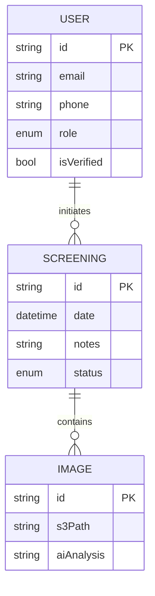

# MamaScan - AI-Powered Maternal Health Screening
 
**Live Demo:** [https://mama-scan.vercel.app/landing](https://mama-scan.vercel.app/landing)

## 🌟 Overview

MamaScan is an innovative AI-powered platform designed to improve maternal healthcare accessibility in low-resource settings. The system enables Community Health Volunteers (CHVs) and clinicians to conduct early risk screenings for conditions like d cervical cancer using  AI analysis.

## ✨ Key Features

- **AI-Assisted Screening**: Computer vision models analyze medical images with expert-level accuracy
- **Role-Based Access**: Secure portals for patients, CHVs, clinicians, and administrators
- **HIPAA-Compliant**: End-to-end encrypted health data with strict access controls


## 🛠️ Tech Stack

### Frontend
- **Framework**: Next.js 14 (App Router)
- **UI**: Shadcn/ui + Tailwind CSS
- **State Management**: Zustand
- **Forms**: React Hook Form + Zod validation
- **Authentication**: NextAuth.js

### Backend
- **API**: Django REST Framework
- **Database**: PostgreSQL
- **AI Models**: PyTorch/TensorFlow 
- **Storage**: AWS S3 with medical image encryption

### Infrastructure
- **Frontend Hosting**: Vercel
- **Backend Hosting**: Render
- **CI/CD**: GitHub Actions
- **Monitoring**: Sentry + LogRocket

## 🚀 Getting Started

### Prerequisites
- Node.js 18+
- npm 9+
- Python 3.10+ (for local API development)

### Installation
```bash
# Clone repository
git clone https://github.com/linetgitonga/mama-scan-frontend.git

# Install dependencies
cd mama-scan-frontend
npm install


### Running Locally
```bash
# Development mode
npm run dev

# Build for production
npm run build && npm start
```

## 🔐 Authentication Flow

```
1. User registers with email/phone verification
2. Role-based onboarding (Patient/CHV/Clinician/Admin)
3. JWT token issuance with 2hr expiry
4. Silent refresh via secure HTTP-only cookies
```

## 🌍 Deployment Architecture

```
                          ┌─────────────┐
                          │   Vercel    │
                          │  (Frontend) │
                          └──────┬──────┘
                                 │ HTTPS
                          ┌──────▼──────┐
                          │ AWS API GW  │
                          └──────┬──────┘
                                 │
┌──────────┐    ┌────────┐    ┌──▼───┐    ┌────────────┐
│ Mobile   ├───►│ Cloud- │    │ EC2  ├───►│  PostgreSQL│
│ Clients  │    │  Flare │    │(BE)  │    │  Database  │
└──────────┘    └────────┘    └──┬───┘    └────────────┘
                                 │
                          ┌──────▼──────┐
                          │   S3 +      │
                          │  Rekognition│
                          └─────────────┘
```

## 📊 Data Model (Simplified)



## 🤖 AI Integration

1. **Data Upload**: Upload data
2. **Preprocessing**: Noise reduction + standardization
3. **Model Inference**: 
   - Cervical lesions: EfficientNet-B4 (89% AUC)
4. **Human Review**: Clinician validation before final diagnosis

## 🌱 Contributing

1. Fork the repository
2. Create your feature branch (`git checkout -b feature/AmazingFeature`)
3. Commit your changes (`git commit -m 'Add some AmazingFeature'`)
4. Push to the branch (`git push origin feature/AmazingFeature`)
5. Open a Pull Request

## 📜 License

GNU Affero General Public License v3.0

## 📞 Contact

Project Lead - Najma
Team Member -Patricia Murira
Team Member- Zawadi
Technical Questions - Linet Gitonga (linetgitonga55@gmail.com)

## 🙏 Acknowledgments

- Kenya Ministry of Health partners
- Open-source medical AI communities


---

**Note**: This is a production system handling sensitive health data. All contributors must complete HIPAA training before accessing PHI-related code.